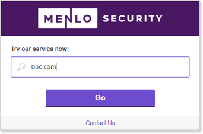

# Connectivity Workshop

We appreciate that a lot of our customers use Proxy Chaining, however, for the purpose of this training you will be using the PAC file.

You will have total control of the windows environment within the CloudShare virtual machine. The environment is Windows Server 2022 Standard.

Before you begin, in CloudShare on your virtual machine, ensure the Chrome browser is configured to allow Cookies in Incognito mode, or you may see looping issues. This can be set using the slider in the Incognito browser or by navigating to Settings | Privacy & Security | Third-party cookies and set Block third-party cookies in incognito mode to Off. Choose Allow third-party cookies.

Notes:
•	Please ensure you are not accessing the CloudShare environment in isolation as you may see issues with keyboard and mouse access when working in isolation.
•	Be aware that the isolation indicators and block pages you see on your lab environment may differ from the examples shown in the lab documents.

 
Exercise 1: Test Pre-Pend
1.	Connect to the CloudShare environment using the instructions provided by the email you have received.
2.	Open the Chrome browser and navigate to https://bbc.com using the prepend notation:
 a.	Type https://safe.menlosecurity.com.
 b.	Enter bbc.com, or a domain of your choice, in the dialogue as shown below:
 

3.	Log on as admin@menlo-student<n>.com where <n> is your student number provided by the instructor.  Use the password provided to you by the instructor. 
4.	Click on a link on the page.
5.	Notice that the site you go to is isolated and the URL is prepended with safe.menlosecurity.com.
