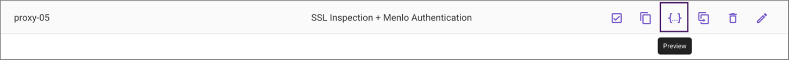

# Connectivity

Exercise 2: Configure Proxy Auto Config 

1.	Using the Chrome Browser, log in to the Admin Portal using https://admin.menlosecurity.com as admin@menlo-student<n>.com
(The Admin Portal URL has been saved as a bookmark on your Bookmark Bar on Chrome.)
2.	Type the password provided to you by the instructor.
3.	Click the App Switcher   
4.	Select Settings | Traffic | PAC Settings.
5.	From the PAC Settings Screen, Click the button  
6.	Use the properties below to create your PAC file. Remember that <n> is your two-digit student number:

Property	Value
Display Name	proxy-<n>
Filename	proxy-<n>.dat
Proxy Mode	SSL Inspection + Menlo Authentication (Port:3129)

7.	Take some time to review the settings you have available in:
  a.	Direct Connect – Enable the toggle to view the Office 365 URLs and IPs.
  b.	Proxy & Roaming – Enable proxy and roaming settings to view the settings.
  c.	Default Exceptions – Expand some of the exceptions to view the domains.
  d.	Domain Exceptions – Notice that you can import a list of domains.  
  e.	Subnet/IP Exceptions.
8.	Once you have reviewed the options, ensure you leave all the settings as default.
9.	Click Save and then Save again.
10.	Select your new file (proxy-<n>) and click on the preview icon.

 

11.	 If you understand JavaScript, review the PAC file. Notice the domains which will be directly accessed.
12.	Close the preview window.
13.	Copy the location of the PAC file .  You will receive confirmation that the PAC file has been copied to the clipboard.

